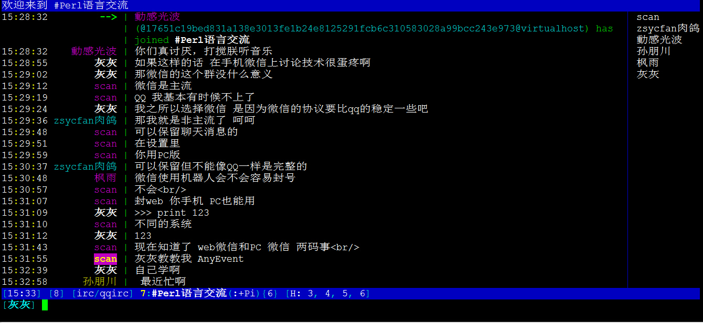

Mojo-Weixin v1.4.4 [](https://travis-ci.org/sjdy521/Mojo-Weixin) [](API.md) [](http://jq.qq.com/?_wv=1027&k=kjVJzo) [](http://irc.perfi.wang/?channel=#Mojo-Webqq)
[](https://github.com/996icu/996.ICU/blob/master/LICENSE)
========================

使用Perl语言编写的微信客户端框架，基于Mojolicious，要求Perl版本5.10+，可通过插件提供基于HTTP协议的api接口供其他语言或系统调用

### 郑重声明

本项目完全遵循微信官方提供的原始功能，不包含任何破坏、盗号等行为，本项目完全开源，目的是为了促进技术交流学习，禁止任何对国家、企业、个人等构成危害的非法用途，否则后果自负

### 特色功能

* 支持 发送/接收文字、图片、视频、语音、表情、文件等多种媒体消息（网页版自身功能范围）
* 支持 新增/失去好友、新增/退出群组、新增/失去群成员 等事件提醒
* 支持 创建群组、群组加人/踢人、发送/接受好友验证申请、设置群组名称、设置好友备注
* 支持 Windows/Linux/Mac 多平台，支持docker镜像，易安装部署，不懂Perl也能用
* 提供 基于HTTP协议的API接口 ，简洁丰富，方便和其他编程语言集成
* 一个产品经理的倾情之作，代码由内而外都更加注重“用户体验”，外加主人人品极好，你会懂的

### 插件列表

|名称                | 优先级  |当前状态    |github作者   | 功能说明                 
|:-------------------|:--------|:-----------|:------------|:----------------------------
|[ShowMsg](https://metacpan.org/pod/distribution/Mojo-Weixin/lib/Mojo/Weixin.pod#Mojo::Weixin::Plugin::ShowMsg)             |100      |已发布      |sjdy521      |打印客户端接收和发送的消息
|[IRCShell](https://metacpan.org/pod/distribution/Mojo-Weixin/lib/Mojo/Weixin.pod#Mojo::Weixin::Plugin::IRCShell)            |99       |已发布      |sjdy521      |Linux环境下通过irc客户端使用微信
|[Openwx](https://metacpan.org/pod/distribution/Mojo-Weixin/lib/Mojo/Weixin.pod#Mojo::Weixin::Plugin::Openwx)              |98       |已发布      |sjdy521      |提供微信发送消息api接口
|[Beauty](https://metacpan.org/pod/distribution/Mojo-Weixin/lib/Mojo/Weixin.pod#Mojo::Weixin::Plugin::Beauty)              |95       |已发布      |sjdy521      |识别指定关键字发送美女图片
|[Translation](https://metacpan.org/pod/distribution/Mojo-Weixin/lib/Mojo/Weixin.pod#Mojo::Weixin::Plugin::Translation)         |93       |已发布      |sjdy521      |多国语言翻译功能
|[KnowledgeBase](https://metacpan.org/pod/distribution/Mojo-Weixin/lib/Mojo/Weixin.pod#Mojo::Weixin::Plugin::KnowledgeBase)       |2        |已发布      |sjdy521      | 通过微信消息自定义问答知识库
|[AutoVerify](https://metacpan.org/pod/distribution/Mojo-Weixin/lib/Mojo/Weixin.pod#Mojo::Weixin::Plugin::AutoVerify)          |1        |已发布      |sjdy521      |收到好友验证请求时自动批准同意
|[PostQRcode](https://metacpan.org/pod/distribution/Mojo-Weixin/lib/Mojo/Weixin.pod#Mojo::Weixin::Plugin::PostQRcode)          |0        |已发布      |sjdy521      |登录二维码发送到邮箱实现远程扫码
|[UploadQRcode](https://metacpan.org/pod/distribution/Mojo-Weixin/lib/Mojo/Weixin.pod#Mojo::Weixin::Plugin::UploadQRcode)          |0        |已发布      |sjdy521      |二维码上传图床获得公网访问url
|[XiaoiceReply](https://metacpan.org/pod/distribution/Mojo-Weixin/lib/Mojo/Weixin.pod#Mojo::Weixin::Plugin::XiaoiceReply)        |1        |已发布      |sjdy521      |利用微软小冰实现智能聊天回复
|[ShowQRcode](https://metacpan.org/pod/distribution/Mojo-Weixin/doc/Weixin.pod#Mojo::Weixin::Plugin::ShowQRcode)          |0        |已发布      |sjdy521  |调用系统图片查看程序来示二维码（目前仅支持win）
|[SmartReply](https://metacpan.org/pod/distribution/Mojo-Weixin/lib/Mojo/Weixin.pod#Mojo::Weixin::Plugin::SmartReply)          |0        |已发布      |sjdy521      |智能聊天回复

更多插件参考[完整插件列表](Plugin.md)

### 效果展示

敲一行命令就能启动一个智能聊天机器人，Perl 和你都如此优雅. Enjoy!

    cpanm Mojo::Weixin && perl -MMojo::Weixin -e "Mojo::Weixin->new->load('ShowMsg')->load('SmartReply')->run()"
    
```
[16/01/19 23:10:49] [info] 客户端准备登录...
[16/01/19 23:10:50] [info] 清除残留的历史二维码图片
[16/01/19 23:10:30] [info] 二维码已下载到本地[ /tmp/mojo_weixin_qrcode.jpg ]
[16/01/19 23:11:20] [info] 等待手机微信扫描二维码...
[16/01/19 23:12:09] [info] 手机微信扫码成功，请在手机微信上点击 [登录] 按钮...
[16/01/19 23:12:10] [info] 正在进行登录...
[16/01/19 23:12:10] [info] 微信登录成功
[16/01/19 23:13:40] [info] 获取联系人信息...
[16/01/19 23:13:40] [info] 更新个人信息成功
[16/01/19 23:14:41] [info] 更新好友信息成功
[16/01/19 23:15:42] [info] 更新群组[ 红包群 ]信息成功
[16/01/19 23:15:42] [info] 更新群组[ Perl语言交流 ]信息成功
[16/01/19 23:15:42] [info] 开始接收消息...
[16/01/19 23:15:00] [群消息] 小灰|Perl语言交流 : Mojo::Weixin不错哦
[16/01/19 23:15:58] [群消息] 我->Perl语言交流 : 多谢多谢
```
#### 通过irc客户端在linux终端上使用微信

```
    +-------------------+                      +----------------+  
    |  Tencent          |                      | Any IRC Client |
    |  Weixin Server    |                      | wechat、irssi  |
    +---v-------------^-+                      +-v------------^-+     
        |             |                          |            |
        | 微信协议交互|                          |IRC协议交互 |
+-- --- |--  - -  --  | - - -   --   -  -   ---  | ---  ----- | --+
|   +---v-------------^--+                  +----v------------^-+ |   
|   |                    <——————————————————<                   | |
|   |   Weixin  Client   |  Weixin - IRC    |  IRC Server       | |
|   |                    |     协议转换     |  监听本机6667端口 | |
|   |                    >——————————————————>                   | | 
|   +--------------------+                  +-------------------+ |
|                                                                 |
|                                       我们程序实现的部分        | 
+---  - - - -  -- - --  ----  ------  -------  ------  ---    ----+

```



#### 更多应用效果 请参见[Mojo-Weixin作品展](Collection.md)

### 安装方法

推荐使用[cpanm](https://metacpan.org/pod/distribution/App-cpanminus/bin/cpanm)在线安装[Mojo::Weixin](https://metacpan.org/pod/distribution/Mojo-Weixin/doc/Weixin.pod)模块, 如果使用docker方式请参见[Docker镜像安装及使用方法](Docker.md)

1. *安装perl*
  
    安装之前请先确认下你的系统是否已经安装了Perl，因为除了windows，其他大部分的平台默认都可能已经预装过

    并且你的Perl版本至少5.10.1+，推荐5.14+

    [Perl官网下载页面](https://www.perl.org/get.html) 有包含Unix/Linux、Mac OS X、Windows多平台比较全面详细的安装说明

    建议大家尽量选择**Binaries**（二进制预编译）的版本，安装即可使用，比较方便

    Linux上如果你的perl版本较低，想要升级perl，可以考虑使用工具[perlbrew](https://perlbrew.pl/)

    |平台    |推荐选择  |下载地址         |
    |:-------|:--------|:---------------|
    |Windows |1. **StrawberryPerl**<br>2. ActivePerl<br>3. **Mojo-StrawberryPerl**|[StrawberryPerl下载地址](http://strawberryperl.com/)<br>[Mojo-StrawberryPerl下载地址](https://github.com/sjdy521/Mojo-StrawberryPerl)<br>[ActivePerl下载地址](http://www.activestate.com/activeperl/downloads)<br>|
    |Linux   |1. **系统自带**<br>2. **yum/apt等包管理器**<br>3. 官方源码编译<br>4. ActivePerl<br>5. DWIM-Perl|[ActivePerl下载地址](http://www.activestate.com/activeperl/downloads)<br>[DWIM-Perl下载地址](http://dwimperl.com/linux.html)|
    |Mac     |1. **系统自带**<br>2. ActivePerl|[ActivePerl下载地址](http://www.activestate.com/activeperl/downloads)|
  
    注意：
    
    [Mojo-StrawberryPerl](https://github.com/sjdy521/Mojo-StrawberryPerl)是基于StrawberryPerl精简打包而成，适用于windows 32位/64位系统

2. *安装cpanm工具*（如果系统已经安装了cpanm可以忽略此步骤）

    方法a： 通过cpan安装cpanm

        $ cpan -i App::cpanminus
    
    方法b： 直接在线安装cpanm

        $ curl -kL http://cpanmin.us | perl - App::cpanminus

        官方服务器在国外，如果无法访问，可以选择下面的命令：
        
        $ curl http://share-10066126.cos.myqcloud.com/cpanm.pl|perl - App::cpanminus

2. *使用cpanm在线安装 Mojo::Weixin 模块*（如果系统已经安装了该模块，执行此步骤会对模块进行升级）

        $ cpanm Mojo::Weixin
    
    如果安装过程中一直提示下载失败，很可能是因为访问到国外服务器网络比较差
    
    这种情况下可以尝试按如下方式手动指定国内的镜像站点
    
        $ cpanm --mirror http://mirrors.163.com/cpan/ Mojo::Weixin

3. *安装失败可能有帮助的解决方法*
        
    如果你运气不佳，通过cpanm没有一次性安装成功，这里提供了一些可能有用的信息

    在安装 Mojo::Weixin 的过程中，cpan或者cpanm会帮助我们自动安装很多其他的依赖模块
    
    在众多的依赖模块中，安装经常容易出现问题的主要是 IO::Socket::SSL
    
    IO::Socket::SSL 主要提供了 https 支持，在安装过程中可能会涉及到SSL相关库的编译

    对于 Linux 用户，通常采用的是编译安装的方式，系统缺少编译安装必要的环境，则会导致编译失败
    
    对于 Windows 用户，由于不具备良好的编译安装环境，推荐采用一些已经打包比较全面的Perl运行环境
    
    例如比较流行的 strawberryperl 或者 activeperl 的最新版本都默认包含 Mojo::Weixin 的核心依赖模块

    RedHat/Centos:

        $ yum install -y openssl-devel
        
    Ubuntu:

        $ sudo apt-get install libssl-dev
    
    搞定了编译和运行环境之后，再重新回到 步骤2 安装Mojo::Weixin即可
    
    请尽量在root下安装使用，非root下安装使用参考[FAQ](https://github.com/sjdy521/Mojo-Weixin/blob/master/FAQ.md#5-%E9%9D%9Eroot%E8%B4%A6%E5%8F%B7%E5%AE%89%E8%A3%85%E5%90%8E%E6%97%A0%E6%B3%95%E4%BD%BF%E7%94%A8%E9%97%AE%E9%A2%98)
    
    如果仍然有问题，Linux上可以尝试执行如下脚本进行依赖模块检查
    
        $ curl -ks "https://raw.githubusercontent.com/sjdy521/Mojo-Weixin/master/script/check_dependencies.pl"|perl -
        

### 如何使用

1. *我对Perl很熟悉，是一个专业的Perler*

    该项目是一个纯粹的Perl模块，已经发布到了cpan上，请仔细阅读 `Mojo::Weixin` 模块的[使用文档](https://metacpan.org/pod/distribution/Mojo-Weixin/doc/Weixin.pod)

    除此之外，你可以看下 [demo](https://github.com/sjdy521/Mojo-Weixin/tree/master/demo) 目录下的更多代码示例

2. *我是对Perl不熟悉，是一个其他语言的开发者，只对提供的消息发送/接收接口感兴趣*

    可以直接把如下代码保存成一个源码文件(必须使用UTF8编码)，使用 perl 解释器来运行
    
        #!/usr/bin/env perl
        use Mojo::Weixin;
        my ($host,$port,$post_api);
        
        $host = "0.0.0.0"; #发送消息接口监听地址，没有特殊需要请不要修改
        $port = 3000;      #发送消息接口监听端口，修改为自己希望监听的端口
        #$post_api = 'http://xxxx';  #接收到的消息上报接口，如果不需要接收消息上报，可以删除或注释此行
        
        my $client = Mojo::Weixin->new(log_level=>"info",http_debug=>0);
        $client->load("ShowMsg");
        $client->load("Openwx",data=>{listen=>[{host=>$host,port=>$port}], post_api=>$post_api});
        $client->run();
    
    上述代码保存成 xxxx.pl 文件，然后使用 perl 来运行，就会完成 微信 登录并在本机产生一个监听指定地址端口的 http server
    
        $ perl xxxx.pl
    
    发送好友消息的接口调用示例
    
        http://127.0.0.1:3000/openwx/send_friend_message?id=xxxx&content=hello
        
        * About to connect() to 127.0.0.1 port 3000 (#0)
        *   Trying 127.0.0.1...
        * Connected to 127.0.0.1 (127.0.0.1) port 3000 (#0)
        > GET /openwx/send_friend_message?id=xxxxx&content=hello HTTP/1.1
        > User-Agent: curl/7.29.0
        > Host: 127.0.0.1:3000
        > Accept: */*
        > 
        < HTTP/1.1 200 OK
        < Content-Type: application/json;charset=UTF-8
        < Date: Sun, 13 Dec 2015 04:54:38 GMT
        < Content-Length: 52
        < Server: Mojolicious (Perl)
        <
        * Connection #0 to host 127.0.0.1 left intact
        
        {"status":"发送成功","id":23910327,"code":0}
    
    更多接口参数说明参考[Openwx插件API文档](API.md)
    
3.  *我是一个极客，我只想能够在命令行上通过  IRC 的方式来玩转微信聊天*

    请阅读[IRCShell插件使用步骤](IRC.md)
    
### 核心依赖模块

* [Mojolicious](https://metacpan.org/pod/Mojolicious)
* [Encode::Locale](https://metacpan.org/pod/Encode::Locale)

### 相关文档

* [更新日志](Changes)
* [开发&配置文档](doc/Weixin.pod)
* [基于HTTP的API文档](API.md)
* [FAQ](FAQ.md)

### 官方交流

* [QQ群](http://jq.qq.com/?_wv=1027&k=kjVJzo)
* [IRC](http://irc.perfi.wang/?channel=#Mojo-Webqq)

### 友情链接

*JavaScript*

* [wechaty](https://github.com/zixia/wechaty) Wechaty is wechat for bot in Javascript(ES6). It's a Personal Account Robot Framework/Library.
* [wechatircd](https://github.com/MaskRay/wechatircd) 用IRC客户端控制微信网页版
* [Weixinbot](https://github.com/feit/Weixinbot) Nodejs 封装网页版微信的接口，可编程控制微信消息

*Python*
* [WeixinBot](https://github.com/Urinx/WeixinBot) 网页版微信API，包含终端版微信及微信机器人
* [ItChat](https://github.com/littlecodersh/ItChat) 微信个人号接口、微信机器人及命令行微信。三十行即可自定义个人号机器人

*Java*
* [wechat-client](https://github.com/dadiyang/wechat-client) Mojo-Weixin HTTP 接口 的 Java 客户端，非常感谢 @dadiyang 贡献

### 赞助奖励

可以通过扫描支付宝付款二维码进行赞助，感谢您的支持和鼓励


特别致谢 [那些曾经赞助的小伙伴们](https://github.com/sjdy521/Mojo-Thanks)

### COPYRIGHT 和 LICENCE

Copyright (C) 2014 by sjdy521

This library is free software; you can redistribute it and/or modify it under [BSD 2-clause "Simplified" license](LICENSE)
